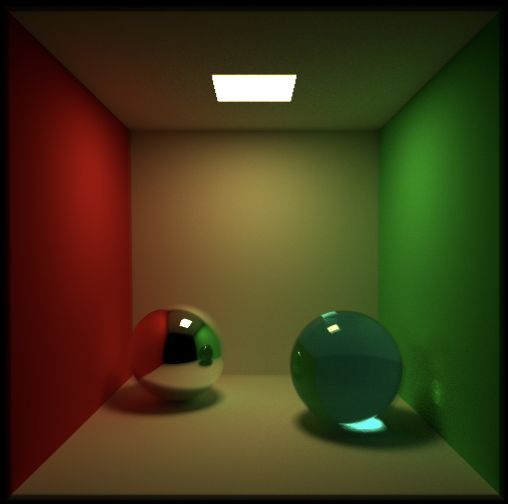
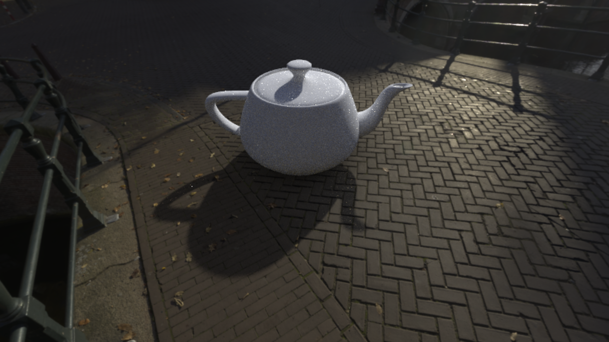
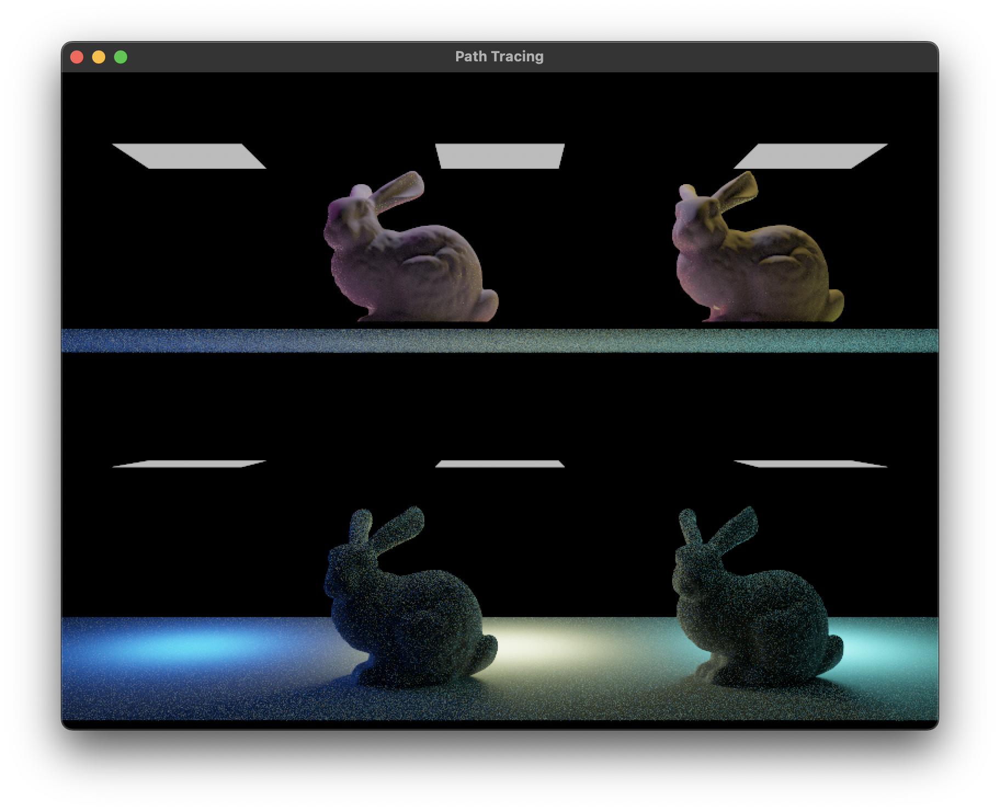

# 02562 - Rendering

This repository contain the code for the course 02562 Rendering at the Technical University of Denmark.

## Technologies Used
- WebGPU
- WGSL
- JavaScript
- HTML

## Course Objectives
- Implementing ray tracing
- Implementing Monte Carlo sampling techniques
- Shaders for rendering
- Simulating Global Illumination effects
- Sampling techniques for ani-aliasing and soft shadows
- Accelerating ray tracing using spatial data structures
- Using radiometric concepts to describe light emission reflection and transmission
- Implementing a path tracer

## Running the code
Code can be executed by using *Live Server* extension on Visual Studio Code and opening each of the HTML files in the browser.

## Example Images

### Area Light Source

### HDR Environment Map

## Ray Tracing using Metal (Extra Project)

As an individual project, it was chosen to apply learned concepts on Metal API for (hardware accelerated) ray tracing on macOS and investigate the debugging capabilities of of Xcode for Metal API.

More details can be found in the [Project Document](./Project/02562___Rendering_Project.pdf).